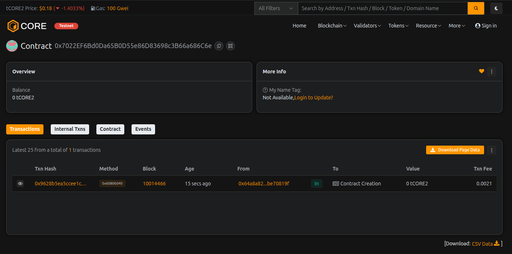

# ChainVault Exchange

## Project Description

ChainVault Exchange is a decentralized exchange (DEX) smart contract built on the Ethereum blockchain using Solidity. It enables users to swap tokens, provide liquidity, and earn fees in a trustless and transparent manner. The platform serves as a foundation for decentralized trading, eliminating intermediaries while ensuring secure and efficient token exchanges.

The smart contract implements core DEX functionality including liquidity pool management, token swapping with automated pricing, fee collection, and provider rewards. It's designed with security, scalability, and user experience in mind.

## Project Vision

Our vision is to democratize access to decentralized finance by creating a robust, secure, and user-friendly exchange platform. ChainVault Exchange aims to:

- **Empower Users**: Give individuals complete control over their assets without relying on centralized intermediaries
- **Foster Liquidity**: Incentivize liquidity providers to create deep, stable markets for token trading
- **Ensure Transparency**: All transactions and fees are recorded on-chain, providing complete transparency
- **Build Trust**: Through open-source code and auditable smart contracts, establish trust in the DeFi ecosystem
- **Enable Innovation**: Provide a foundation for advanced DeFi features and integrations

## Key Features

### 1. **Multi-Token Support**
- Support for multiple ERC-20 tokens and native cryptocurrency (ETH)
- Admin-controlled token whitelist for security

### 2. **Liquidity Pool Management**
- Add liquidity to earn trading fees
- Remove liquidity at any time
- Track individual liquidity provider balances

### 3. **Token Swapping**
- Instant token swaps between supported pairs
- Automated market maker (AMM) pricing mechanism
- Real-time swap quotes before execution

### 4. **Fee System**
- Configurable trading fees (basis points)
- Fee collection on every swap
- Owner-controlled fee adjustments (capped at 10%)

### 5. **Security Features**
- Owner-only administrative functions
- Token validation for all operations
- Liquidity sufficiency checks
- Protection against invalid addresses

### 6. **Transparency**
- Comprehensive event logging for all major actions
- Public view functions for balances and quotes
- On-chain verification of all transactions

### 7. **Ownership Management**
- Secure ownership transfer mechanism
- Owner-controlled protocol parameters
- Emergency controls for platform safety

### 8. **Query Functions**
- Get swap quotes without executing trades
- Check liquidity provider balances
- View total platform liquidity

## Future Scope

### Phase 1: Enhanced Functionality
- **Advanced AMM Models**: Implement Uniswap V2/V3 style constant product formula
- **LP Token System**: Issue liquidity provider tokens representing pool shares
- **Multi-hop Swaps**: Enable swaps through multiple pools for better rates
- **Price Oracles**: Integrate Chainlink or similar oracles for accurate pricing

### Phase 2: DeFi Integration
- **Yield Farming**: Reward liquidity providers with governance tokens
- **Staking Mechanisms**: Allow users to stake tokens for additional rewards
- **Governance System**: Implement DAO for community-driven decision making
- **Cross-chain Bridges**: Enable asset transfers across multiple blockchains

### Phase 3: Advanced Features
- **Limit Orders**: Support for limit and stop-loss orders
- **Margin Trading**: Leverage trading with collateralized positions
- **Flash Loans**: Provide uncollateralized loans for arbitrage and liquidations
- **NFT Integration**: Support for NFT-backed liquidity and trading

### Phase 4: Scalability & Performance
- **Layer 2 Integration**: Deploy on Optimism, Arbitrum, or zkSync for lower fees
- **Gas Optimization**: Further optimize contract for reduced transaction costs
- **Batch Operations**: Allow multiple swaps in a single transaction
- **Analytics Dashboard**: Comprehensive UI for tracking performance and yields

### Phase 5: Ecosystem Growth
- **Mobile Application**: Native iOS and Android apps
- **API Development**: RESTful and GraphQL APIs for integrations
- **Developer SDK**: Tools for building on top of ChainVault
- **Educational Content**: Tutorials, documentation, and community resources

---

## Project Structure

```
ChainVault-Exchange/
│
├── contracts/
│   └── ChainVaultExchange.sol
│
├── README.md
│
└── (future additions)
    ├── test/
    ├── scripts/
    └── docs/
```

## Getting Started

### Prerequisites
- Node.js v16+
- Hardhat or Truffle
- MetaMask or similar Web3 wallet

### Installation
```bash
# Clone the repository
git clone <repository-url>

# Install dependencies
npm install

# Compile contracts
npx hardhat compile

# Run tests
npx hardhat test

# Deploy to network
npx hardhat run scripts/deploy.js --network <network-name>
```

## Contributing

We welcome contributions! Please see our contributing guidelines for more details.

## License

This project is licensed under the MIT License.

## Contact

For questions, suggestions, or partnerships, please reach out to our team.

---

**Disclaimer**: This smart contract is provided as-is for educational and development purposes. Always conduct thorough audits before deploying to mainnet.

---

## Contract Details:

Transaction id: 0x7022EF6Bd0Da65B0D55e86D83698c3B66a686C6e
